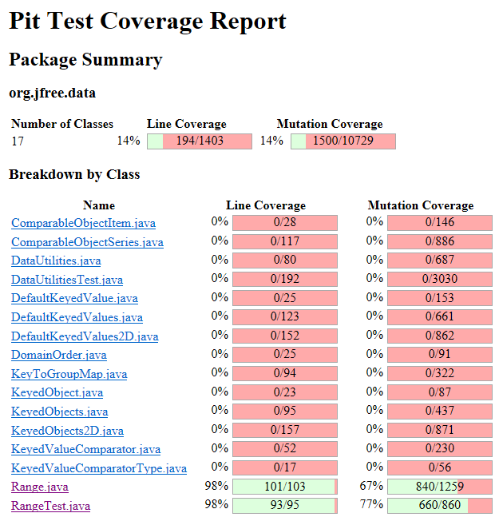
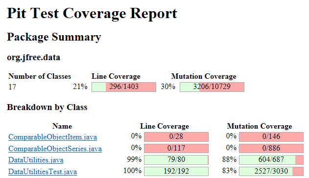
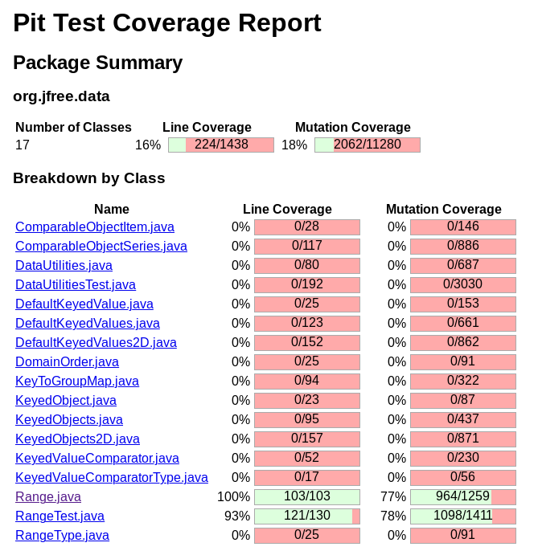
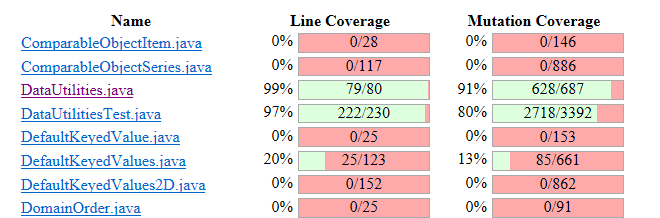

**SENG 438 - Software Testing, Reliability, and Quality**

**Lab. Report \#4 – Mutation Testing and Web app testing**

| Group \#:      |  5  |
| -------------- | --- |
| Student Names: |  Nicholas Knapton   |
|                |  Jacob Artuso   |
|                |  Brian Kramer  |
|                |  Colin Christophe   |

# Introduction
In this lab we experimented with mutation testing on the JFreeChart software provided in the lab. We took our unit tests developed in assignment 2 and 3 to evalute them against the mutants created. We used knowledge of different types of mutants presented in class along with documentation online to identify where our tests could improve and fix them.

# Analysis of 10 Mutants of the Range class

### getLowerBound : replaced double return with 0.0d for org/jfree/data/Range::getLowerBound -> KILLED
This mutant replaces the return value with 0.0 instead of the lowerBound. This mutant was killed with our original test suite as we had a test for the function getLowerBound() with the range -1,1. By returning 0.0 our test caught it as we were expecting it to return -1.

### getCentralValue : Substituted 2.0 with 1.0 -> KILLED 
This mutant changes the 'this.lower / 2.0' to 'this.lower / 1.0'. We can see that our original test suite tests this function using a range of -1 to 1. Thus, the statement will originally give -0.5 but the mutant will make it -1. This is the improper value and will be killed.  

### getCentralValue : Replaced double addition with subtraction -> KILLED
This mutant replaces the addition between "this.lower / 2.0" and "this.upper / 2.0" and replaces it with subtraction. This mutant was then killed by our original test suite as the output for all test cases completely changes. For example our test with a range of -1,1 expects a return of 0, however with this mutant the return becomes (-1 / 2) - (1 / 2) = -1 and thus the test case fails and mutant is killed.

### shift : removed call to org/jfree/data/util/ParamChecks::nullNotPermitted -> SURVIVED
This mutant removes the call to nullNotPermitted at the start of the function completely. This mutant survived in our original test suite as we didnt create a test that gave a null Range. This caused all our original unit tests to pass as none of them utilized this function call.

### contains : greater than to less or equal -> KILLED
This mutant changes the boolean return from 'return (value >= this.lower && value <= this.upper);' to 'return (value <= this.lower && value <= this.upper);'. This mutant will be killed by our test case that has range or -1 to 1 with value equal to 0 because originally this retrurn will be true but with the mutant value <= this.lower will be false. Since the mutant will be false and not the expected true it will be killed. 

### min : removed conditional - replaced equality check with false -> SURVIVED
This mutant will replace the 'Double.isNaN(d1)' with false. Since we did not explicitly test this function in our assignment 3 test suite the mutant survived. However, if we created a test where d1 is not a number then this mutant would be killed. 

### shift : negated conditional -> SURVIVED
This mutant will negate the allowZeroCrossing boolean. i.e if the boolean is false it will make it true and vice versa. Since we did not test the shift function extensively this mutant was not killed. 

### expand : removed call to org/jfree/data/Range::getLength -> KILLED
This mutant removed the call to getLength in "double length = getLength()". This mutant failed as it then tried to subtract the uninitialized "length" and resulted in an error, causing the test to fail and the mutant to be killed.

### shiftWithNoZeroCrossing : Substituted 0.0 with 1.0 -> SURVIVED
This mutant substitutes the 0.0 in "if(value > 0.0)" to 1.0. This mutant survived our original tests as all the tests we had either had value less then 0 (in this case the expected equility doesnt change) or value was greator then 1.0 (which again wouldnt result in a change of expected equality).

### equals : replaced boolean return with false for org/jfree/data/Range::equals -> KILLED
 This mutant will change the 'return true' statement to 'return false'. This will cause the mutant to be killed for any test cases that reaches that line of the equals(Object obj) function. 

# Report all the statistics and the mutation score for each test class

# Analysis drawn on the effectiveness of each of the test classes
Our DataUtilities test class was highly effective from lab assignment 3 however, we were still able to find other mutants to kill fro the improvement of our test suite. For our Range test class it was not near as effective from lab 3 as DataUtitlities so we were able to improve it by a greater margin. It is important to note that many of the unresolved mutants in the Range class were equivalent mutants. 

# A discussion on the effect of equivalent mutants on mutation score accuracy
Throughout the Range class there are many equivalent mutants that make the mutation score appear much lower than it actually is. For example, there are several increment and decrement mutations where it decrements a variable in the return line, however , since it will decrement the variable after it returns the mutant is equivalent. However in the DataUtilities class we found much less equivalent mutants and thus the mutation coverage more accurately represents the true "mutation coverage" of our tests.

These equivalent mutants cannot be "killed" because the have the same behaviour as the original program. This then can artificially decrease the mutation score accuracy and make it appear lower then it actually is. Because of this, testers should use caution when analyzing the mutation coverage and take into account the equivalent mutants.

# Detecting Equivalent Mutants
When performing our mutant tests we made sure to keep an eye out for equivalent mutants. We did this mainly by analizing the code as we looked at "surviving mutants" and traceing through to see if the mutant is equivilent to the original code. This however wa very time intensive and took a while everytime we tried to evaluate. An easy one to detect we found was incrementing the return variable (a++) causing the variable to increment after it returns and thus being equivent to the original code.

We did some research on how you could maybe automatically detect equivalent mutants and it seems like an active area of research. And while we couldnt come up with any ideas on how you could (effictively) detect equivalent mutants, we did come up with an infeasable way. You could take the mutant and the original code and loop though tons of posible inputs and compare their outputs, any ones that survive the large test set and produce the same output are most likely equivilent. However this is definetly not feasable!

# A discussion of what could have been done to improve the mutation score of the test suites
Our group decided to look through the functions were were testing to figure out how each mutation could alter an outcome. We then looked for test cases that could fit this criteria. For example if a mutation changed a < b to a <= b we would make sure we had a test case where a == b so the mutation would be killed. Using this process to iterate through the mutation report we were able to improve the mutation score of the test suites. Our group found that most mutations were sensitive to boundary testing and variables found in multiple decision statements. In order to improve mutation score tester's should focus on adding tests that will are on boundaries and are used in multiple decision statements. This should maximize the amount of mutations killed.

# Why do we need mutation testing? Advantages and disadvantages of mutation testing
Mutation testing is needed to verify the completeness of our test suite. It introduces changes to the code to ensure that your test cases can correctly detect the change, this is also called "bug injection". The general idea with this then is that if our test suite can detect a variety of "injected bugs"/Mutants then our test suite is more likely to be an effictive test suite. In summary we need mutation testing to help verify the effectiveness of our test suite.

Some advantages of mutant testing is the ability to measure quality of test cases, detect potential gaps in your test suite, know when to stop testing, and compare testing strategies. Mutant testing just gives another metric to evaluate how well we have tested the SUT.

# Explain your SELENUIM test case design process
Our test case design process involved identifying key functionalities of the system, such as longing in and purchasing items, then writing test which verify the system is running properly.

# Explain the use of assertions and checkpoints
Assertions are used to make sure the system ends in the correct state. Checkpoints are used for when longer paths must be taken, ensuring that the correct paths are being taken prior to running specified tests.

# how did you test each functionaity with different test data
We made many individual test cases, each with different data, including null, and NaN. For some tests we used paramaterized testing allowing us to test many test data quickly and efficiently.

# Discuss advantages and disadvantages of Selenium vs. Sikulix

# How the team work/effort was divided and managed
Our group split into pairs and one pair did the DataUtilities mutation testing while the other did the Range mutationt testing. Then each group member did 2 GUI tests. Finally, each group member helped create the lab report.

# Difficulties encountered, challenges overcome, and lessons learned
During our testing we had some difficulties interpretting how certain mutatnts worked and figuring out which mutants were equivalent. Eventually, we were able to solve these problems and learn more about how specific mutants would operate in a test setting.

# Comments/feedback on the lab itself
Interesting lab in which we explore how to use mutation testing in order to improve our test suite. Also, selenium seems like a powerful tool that can be even used outside of testing when needing to automate website interactions.
